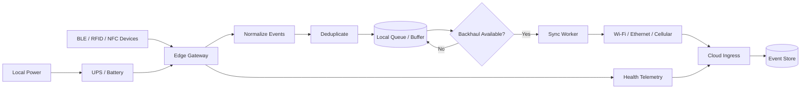

# IoT Edge Reference Architecture

A public reference architecture for resilient connected-device systems operating across BLE, RFID/UHF, NFC, Wi-Fi, cellular, and intermittently connected edge environments.

This project focuses on the practical engineering problems that appear after the whiteboard: duplicate detections, weak signals, intermittent backhaul, local buffering, device identity, power loss, and reliable cloud synchronization.

## What This Project Demonstrates

- Edge-first system design
- BLE proximity and RSSI handling
- RFID/UHF and NFC event patterns
- Local buffering during connectivity loss
- Store-and-forward synchronization
- Event deduplication
- Device identity normalization
- Multi-path connectivity
- Power-resilience concepts
- Health telemetry and observability
- Safe separation between field devices and cloud services

## Reference Architecture



## Core Design Principles

**Offline is a normal operating state**  
Field systems should degrade gracefully when the WAN disappears.

**Raw radio observations are not business events**  
BLE RSSI, RFID reads, and repeated scans should be filtered and normalized before reaching the cloud.

**Identity must be stable**  
Device identity should not depend solely on transient network addresses.

**Deduplication belongs close to the edge**  
Repeated radio observations can create excessive traffic and false events if every detection is forwarded upstream.

**Backhaul should be replaceable**  
Wi-Fi, Ethernet, LTE/5G, or satellite should sit behind a common connectivity layer.

**Power failure is part of field reliability**  
A gateway that loses all state during a short outage is not resilient.

## Example Event Flow

1. A field radio observes a device.
2. The gateway records the raw observation.
3. The event is normalized to a stable device identity.
4. Signal and timing rules determine whether it represents a meaningful event.
5. Duplicate observations inside a configurable window are suppressed.
6. The accepted event is written to durable local storage.
7. A synchronization worker sends queued events when backhaul is available.
8. The cloud acknowledges receipt.
9. The gateway marks the local event as synchronized.

## Repository Layout

```text
iot-edge-reference-architecture/
├── docs/
│   ├── architecture.md
│   ├── ble-proximity.md
│   ├── offline-first.md
│   ├── connectivity.md
│   └── power-resilience.md
├── src/
│   ├── domain/
│   │   └── edge-event.ts
│   ├── processing/
│   │   └── deduplicate.ts
│   └── sync/
│       └── store-and-forward.ts
├── examples/
│   └── edge-event.example.json
├── .gitignore
└── README.md
```

## Production vs. Public Reference

This repository is intentionally generic. It contains no former-employer source code, customer data, proprietary device configuration, internal network details, private firmware, or production credentials.

## Planned Enhancements

- Gateway health scoring
- Connectivity failover policy
- Event replay tooling
- Local SQLite queue example
- MQTT transport example
- Device provisioning lifecycle
- Firmware version inventory
- Edge security model
