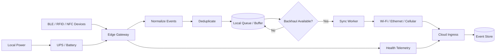

# IoT Edge Reference Architecture

A public reference architecture for resilient connected-device systems operating across BLE, RFID/UHF, NFC, Wi-Fi, cellular, and intermittently connected edge environments.

## Executive Lens

IoT reliability is an operations problem as much as a device problem. This architecture is built around the realities that field systems lose connectivity, radio observations are noisy, power is imperfect, and hardware must remain supportable after the original engineer leaves the project.

**Leadership questions this design addresses:**

- What continues to work when the WAN disappears?
- How do we prevent noisy radio data from becoming noisy business events?
- How do we identify, monitor, and recover devices across changing field conditions?
- Which responsibilities belong at the edge and which belong in the cloud?
- What information must survive handoff from engineering to deployment and support?

This project focuses on the practical engineering problems that appear after the whiteboard: duplicate detections, weak signals, intermittent backhaul, local buffering, device identity, power loss, and reliable cloud synchronization.

## What This Project Demonstrates

- Edge-first system design
- BLE proximity and RSSI handling
- RFID/UHF and NFC event patterns
- Local buffering during connectivity loss
- Store-and-forward synchronization
- Event deduplication
- Device identity normalization
- Multi-path connectivity
- Power-resilience concepts
- Health telemetry and observability
- Safe separation between field devices and cloud services

## Reference Architecture



## Core Design Principles

**Offline is a normal operating state**  
Field systems should degrade gracefully when the WAN disappears.

**Raw radio observations are not business events**  
BLE RSSI, RFID reads, and repeated scans should be filtered and normalized before reaching the cloud.

**Identity must be stable**  
Device identity should not depend solely on transient network addresses.

**Deduplication belongs close to the edge**  
Repeated radio observations can create excessive traffic and false events if every detection is forwarded upstream.

**Backhaul should be replaceable**  
Wi-Fi, Ethernet, LTE/5G, or satellite should sit behind a common connectivity layer.

**Power failure is part of field reliability**  
A gateway that loses all state during a short outage is not resilient.

## Example Event Flow

1. A field radio observes a device.
2. The gateway records the raw observation.
3. The event is normalized to a stable device identity.
4. Signal and timing rules determine whether it represents a meaningful event.
5. Duplicate observations inside a configurable window are suppressed.
6. The accepted event is written to durable local storage.
7. A synchronization worker sends queued events when backhaul is available.
8. The cloud acknowledges receipt.
9. The gateway marks the local event as synchronized.

## Repository Layout

```text
iot-edge-reference-architecture/
├── docs/
│   ├── architecture.md
│   ├── ble-proximity.md
│   ├── offline-first.md
│   ├── connectivity.md
│   └── power-resilience.md
├── src/
│   ├── domain/
│   │   └── edge-event.ts
│   ├── processing/
│   │   └── deduplicate.ts
│   └── sync/
│       └── store-and-forward.ts
├── examples/
│   └── edge-event.example.json
├── .gitignore
└── README.md
```

## Production vs. Public Reference

This repository is intentionally generic. It contains no former-employer source code, customer data, proprietary device configuration, internal network details, private firmware, or production credentials.

## Tradeoffs and Decisions

- **Edge filtering before cloud ingestion:** reduces noise and bandwidth, but requires enough local intelligence to make trustworthy decisions.
- **Durable local buffering:** improves resilience during outages, while introducing queue management and replay considerations.
- **Replaceable backhaul:** keeps cellular, Wi-Fi, Ethernet, or satellite from becoming architectural dependencies, at the cost of an abstraction layer that must be maintained.
- **Stable logical device identity:** avoids tying operations to transient network addresses, but requires disciplined provisioning and inventory management.

## What I Would Improve Next

The next layer would be a stronger device-lifecycle model: provisioning, firmware/version inventory, gateway health scoring, connectivity failover policy, MQTT transport, local SQLite persistence, replay tooling, and an explicit edge-security model. Operationally, I would also connect device health and deployment state to support workflows so field telemetry becomes actionable service data.

## Planned Enhancements

- Gateway health scoring
- Connectivity failover policy
- Event replay tooling
- Local SQLite queue example
- MQTT transport example
- Device provisioning lifecycle
- Firmware version inventory
- Edge security model

## Architecture Deep Dive

- [Case study](docs/case-study.md)
- [Architecture decisions](docs/adr/README.md)
- [Reliability and recovery](docs/reliability-recovery.md)

## Validation

GitHub Actions runs behavioral tests for event deduplication and store-and-forward acknowledgement handling, followed by strict TypeScript type-checking.

## Operations Deep Dive

- [Observability and service signals](docs/observability.md)
- [Incident runbook](docs/runbook.md)
- [Example incident scenario](docs/incident-scenario.md)
- [Metrics catalog](examples/metrics-catalog.json)
